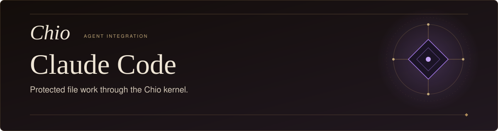
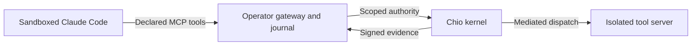

<p align="center">
  <picture>
    <source media="(max-width: 600px)" srcset="docs/assets/readme-hero-mobile.svg" />
    
  </picture>
</p>

<p align="center">
  <a href="LICENSE">Apache-2.0</a>&nbsp;&nbsp;&middot;&nbsp;&nbsp;
  <a href="package.json">Node.js 22+</a>&nbsp;&nbsp;&middot;&nbsp;&nbsp;
  <a href="docs/RESTRICTED-MODE.md">macOS restricted mode</a>
</p>

<p align="center">
  <strong>Claude Code, with kernel-controlled tools.</strong>
</p>

<p align="center">
  <a href="#what-it-does">Overview</a>&nbsp;&nbsp;&middot;&nbsp;&nbsp;
  <a href="#build-from-source">Build</a>&nbsp;&nbsp;&middot;&nbsp;&nbsp;
  <a href="#run-through-the-kernel">Run</a>&nbsp;&nbsp;&middot;&nbsp;&nbsp;
  <a href="#supported-boundary">Scope</a>&nbsp;&nbsp;&middot;&nbsp;&nbsp;
  <a href="#recovery">Recovery</a>&nbsp;&nbsp;&middot;&nbsp;&nbsp;
  <a href="#development">Develop</a>
</p>

---

## What it does

Run Claude Code against tools and data controlled by the [Chio kernel](https://github.com/backbay-labs/chio). The restricted launcher gives Claude an explicit MCP tool inventory while the operator retains the kernel credentials, resource access and execution journal.

- **Scoped access.** The kernel checks the prepared session's delegated authority before protected work.
- **Bound results.** The gateway verifies the receipt signer, caller, request and returned output before accepting an execution result.
- **Recoverable uncertainty.** Unknown outcomes remain in the private journal and block new dispatch until the operator resolves them.

**Status:** A source-build candidate for macOS, with [bounded real-host evidence](acceptance/2026-09-10/final-static-continuation/README.md). Complete I01-I08 acceptance and a compatible published release remain open. The marketplace plugin provides diagnostics; protected execution uses the separate restricted launcher below.

## Build from source

Install Node.js 22 or newer and Git, then build the public checkout:

```sh
git clone https://github.com/backbay-labs/chio-claude-code-plugin.git
cd chio-claude-code-plugin
npm ci --ignore-scripts --no-audit --no-fund
npm run build
```

The lockfile and checked-in `vendor/` archives supply the Chio bridge and SDK. No sibling checkout is required. The build produces the bundled runtime in `dist/`.

Building the plugin does not prepare a kernel session. Protected execution also requires macOS, a qualified Claude executable, a compatible running kernel and an isolated resource server. Follow the [operator preparation guide](docs/RESTRICTED-MODE.md#boundary-and-preparation) before launching work.

## Run through the kernel

### 1. Prepare authority

The operator chooses the policy, trusted receipt signers and allowed tools, then prepares a retained kernel session. From this checkout, the bundled bridge dependency provides the preparation command:

```sh
node node_modules/@chio/bridge/dist/prepare-gateway.js \
  /operator/private/claude-prepare.json \
  /operator/private/new-claude-gateway.json
```

The [runbook](docs/RESTRICTED-MODE.md#boundary-and-preparation) describes the input fields and required kernel contract. Preparation pins the session and capability, exchanges operator authority for a scoped credential, and writes the private gateway configuration. It executes no protected tool.

### 2. Launch a task

Use paths and artifact pins from the selected qualification record. Set `CLAUDE_HOST_SHA256`, `CHIO_GATEWAY_SHA256` and `CHIO_MODEL` accordingly; the gateway hash identifies this build's `dist/gateway-http.js`. The profile must be new, and the local workspace must already exist. Keep the profile, gateway configuration and journal in separate locations outside the local workspace.

```sh
node scripts/restricted.mjs \
  --host /absolute/path/to/claude \
  --host-sha256 "$CLAUDE_HOST_SHA256" \
  --gateway-sha256 "$CHIO_GATEWAY_SHA256" \
  --gateway-config /operator/private/new-claude-gateway.json \
  --profile /operator/new-claude-profile \
  --workspace /operator/empty-workspace \
  --model-auth claude-login \
  --model "$CHIO_MODEL" < /operator/task.txt
```

For a filesystem owner exposing the corresponding read and write tools, a task could be:

> Read `/workspace/notes.md`, write a concise summary to `/workspace/summary.md`, then read the summary back.

Those paths belong to the resource owner. The launcher's local workspace does not give Claude direct access to that storage.

`--model-auth claude-login` uses the operator's existing Claude subscription login through the trusted parent relay. API-key mode is also available. See [authentication setup](docs/RESTRICTED-MODE.md#existing-claude-subscription-login) and [launch requirements](docs/RESTRICTED-MODE.md#launch).

### 3. Inspect the outcome

The profile retains `launch.json` and `exit.json`; the private gateway journal retains request-bound outcomes. Treat `state: completed` with verified evidence and `result.isError: false` as a successful tool result. A model's summary alone is insufficient. Unknown results stay unresolved and must not be retried automatically.

Output sanitization can mask a filename without invalidating a successful operation. Later authorized steps retain the original known path. See [result semantics](docs/RESTRICTED-MODE.md#result-semantics) for the distinction between output masking, receipt redaction and tool errors.

## Supported boundary



The macOS sandbox restricts Claude to the operator's local MCP transport and bounded Messages relay. Kernel credentials, the authoritative journal, protected storage and resource credentials remain outside the host's access.

| Available in restricted mode | Unavailable in this mode |
| --- | --- |
| Operator-declared Chio tools, including qualified filesystem workflows | Native Bash, file tools and direct web tools |
| A fresh isolated host session with retained kernel authority | Arbitrary MCP servers, plugins, hooks and custom skills |
| Operator-controlled recovery of retained outcomes | Delegation, background jobs and automatic session resume |

The resource owner must enforce this boundary. A host-visible resource mount or an unguarded second endpoint would defeat it. Expanding the tool or host surface requires its own qualification.

### Compatibility plugin

For diagnostics and bounded hook-contract testing, this repository also remains a Claude marketplace:

```sh
claude plugin marketplace add backbay-labs/chio-claude-code-plugin
claude plugin install chio@chio
```

This installation does not enable the restricted launcher. Real-host probes found that several hook failures let an otherwise permitted native tool execute. Hook configuration therefore does not establish complete mediation. See [compatibility-hook behavior and state](docs/RESTRICTED-MODE.md#compatibility-hooks) and the [host contract probes](SMOKE.md).

## Recovery

After interruption, retain the profile, original request IDs, gateway configuration and journal. Use the resource owner's independent record to determine what happened. Do not clear unknown operations to make a retry succeed.

- [Failure and recovery](docs/RESTRICTED-MODE.md#failure-and-recovery): inspect retained state, recover dead-process locks and preserve unresolved effects.
- [Upgrade and removal](docs/RESTRICTED-MODE.md#upgrade-and-removal): retain evidence, revoke old authority and qualify the replacement.
- [Pinned qualification records](acceptance/2026-09-10/final-static-continuation/README.md): exact versions, executed cases and remaining scope.

## Development

From the source checkout with dependencies installed:

```sh
npm run typecheck
npm run build
npm test
npm run pack:release -- /absolute/new-candidate-directory
```

`pack:release` stages the production dependencies into a self-contained tarball and writes its SHA-256. Direct `npm pack` refuses an unbundled candidate. The [source/package workflow](.github/workflows/ci.yml) additionally checks a fresh offline consumer installation. Build and component-test results do not establish real-host acceptance.

For native host-contract tests, read [SMOKE.md](SMOKE.md) before using its isolated fixture. Its results include demonstrated hook bypasses and are separate from kernel qualification. See [packaging and release qualification](docs/RELEASE-QUALIFICATION.md) for consumer-install checks and the prerequisites enforced by the [release workflow](.github/workflows/release.yml).

## License

[Apache-2.0](LICENSE).
