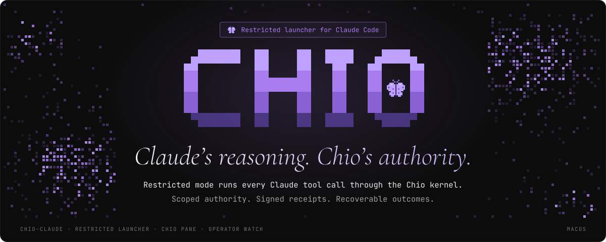
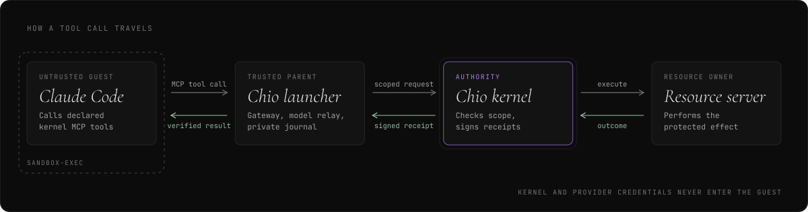

<p align="center">
  <picture>
    <source media="(max-width: 600px)" srcset="docs/assets/readme-hero-mobile.svg" />
    
  </picture>
</p>

<p align="center">
  <a href="#build-from-source">Build</a>&nbsp;&nbsp;&middot;&nbsp;&nbsp;
  <a href="#how-it-works">How it works</a>&nbsp;&nbsp;&middot;&nbsp;&nbsp;
  <a href="docs/GETTING-STARTED.md">Guide</a>&nbsp;&nbsp;&middot;&nbsp;&nbsp;
  <a href="#documentation">Docs</a>&nbsp;&nbsp;&middot;&nbsp;&nbsp;
  <a href="https://www.chio.computer">chio.computer</a>
</p>

---

Chio for Claude Code puts [Claude Code](https://github.com/anthropics/claude-code)
on a kernel. Claude reasons and calls tools. [Chio](https://github.com/backbay-labs/chio)
decides what each call may do, performs it through an isolated resource server,
and returns a signed receipt. Claude never holds kernel or provider credentials.

- **Scoped authority.** The operator prepares the session, its capability and
  its trusted signers before launch. Claude sees the declared kernel MCP tools,
  and nothing else.
- **Signed receipts.** Every result is bound to its signer, caller, request and
  output, and verified before Claude sees it.
- **Recoverable outcomes.** An unknown outcome stays in the private journal and
  blocks new dispatch. Nothing is retried blindly.

## How it works

<p align="center">
  <picture>
    <source media="(max-width: 600px)" srcset="docs/assets/readme-boundary-mobile.svg" />
    
  </picture>
</p>

Claude Code runs under `sandbox-exec` on macOS, with its native Bash, file and
web tools turned off. It can reach two local endpoints, both owned by the
trusted launcher: the kernel gateway and a bounded Messages relay. The launcher
holds the credentials and keeps the private journal. The kernel checks each
call against the delegated authority and dispatches it to the resource server.

## Build from source

Requires Node.js 22 or newer and Git. Protected execution requires macOS.

```sh
git clone https://github.com/backbay-labs/chio-claude-code-plugin.git
cd chio-claude-code-plugin
npm ci --ignore-scripts --no-audit --no-fund
npm run build
```

The lockfile and the checked-in `vendor/` archives supply the Chio bridge and
SDK. No sibling checkout is needed. The build writes the bundled runtime to
`dist/`.

## Run a task

A task needs a running Chio kernel, an isolated resource server and a prepared
gateway session. The [guide](docs/GETTING-STARTED.md#1-prepare-authority) covers
preparation. Take the host, gateway and model pins from the selected
qualification record, then send the task on stdin:

```sh
node scripts/restricted.mjs \
  --host /absolute/path/to/claude \
  --host-sha256 "$CLAUDE_HOST_SHA256" \
  --gateway-sha256 "$CHIO_GATEWAY_SHA256" \
  --gateway-config /operator/private/new-claude-gateway.json \
  --profile /operator/new-claude-profile \
  --workspace /operator/empty-workspace \
  --model-auth claude-login \
  --model "$CHIO_MODEL" < /operator/task.txt
```

`--model-auth claude-login` uses the operator's existing Claude subscription
through the trusted relay. The profile must be new and the workspace must
exist. The profile keeps `launch.json` and `exit.json`, and the private journal
keeps each request-bound outcome. Success is `state: completed` with verified
evidence, not the model's summary. The guide covers
[reading outcomes](docs/GETTING-STARTED.md#3-inspect-the-outcome) and
[recovery](docs/GETTING-STARTED.md#recovery).

## What ships

| Entrypoint | What it is |
| --- | --- |
| `scripts/restricted.mjs` | The restricted launcher: macOS sandbox, host supervisor, kernel gateway and model relay |
| `dist/gateway-http.js` | The kernel MCP gateway, pinned by SHA-256 at launch |
| `chio` plugin | The Claude marketplace plugin: diagnostic `/chio:*` commands and compatibility hooks |
| `@chio/claude-code-plugin` | The library behind the commands: bonds, approvals, revocation, receipts and plugin state |

Only the restricted launcher establishes the operating-system boundary. The
plugin installs on its own, for diagnostics:

```sh
claude plugin marketplace add backbay-labs/chio-claude-code-plugin
claude plugin install chio@chio
```

> [!WARNING]
> **The plugin is not a boundary.** Real-host probes found hook failures that
> let an otherwise permitted native tool run. Protected work needs the
> restricted launcher. See the [host contract probes](SMOKE.md).

## Status

`0.3.1-rc.1` is a source-built candidate for macOS. It is not published to npm.

- **Evidence.** 23 bounded production-mode cases for the pinned `0.3.1-rc.1`
  archive with native Claude 2.1.267 and a local static kernel, recorded in
  [final static continuation](acceptance/2026-09-10/final-static-continuation/README.md).
- **Scope.** Operator-declared Chio tools in a fresh host session. Native tools,
  arbitrary MCP servers, plugins, hooks, custom skills, delegation, background
  jobs and automatic resume are unavailable.
- **Still open.** Complete I01-I08 acceptance and a compatible published release.

## Documentation

| Guide | Covers |
| --- | --- |
| [Getting started](docs/GETTING-STARTED.md) | The full walkthrough: build, prepare, launch, inspect, the boundary and recovery |
| [Restricted mode](docs/RESTRICTED-MODE.md) | The operator runbook: preparation, launch, subscription login, result semantics, failure and upgrade |
| [Release qualification](docs/RELEASE-QUALIFICATION.md) | Packaging, consumer-install checks and release prerequisites |
| [Host contract probes](SMOKE.md) | Native hook-contract tests and the bypasses they found |

Qualification records:
[final static continuation](acceptance/2026-09-10/final-static-continuation/README.md),
[final static initial](acceptance/2026-09-10/final-static-initial/README.md) and the
[2026-09-09 report](acceptance/2026-09-09/REPORT.md).

## Development

```sh
npm ci --ignore-scripts --no-audit --no-fund
npm run typecheck
npm run build
npm test
npm run pack:release -- /absolute/new-candidate-directory
```

`pack:release` writes a self-contained tarball and its SHA-256. Direct
`npm pack` refuses. [Release qualification](docs/RELEASE-QUALIFICATION.md)
covers the consumer-install checks. Build and test results do not establish
real-host acceptance.

---

<p align="center">
  <a href="LICENSE">Apache-2.0</a>&nbsp;&nbsp;&middot;&nbsp;&nbsp;
  <a href="https://www.chio.computer">chio.computer</a>&nbsp;&nbsp;&middot;&nbsp;&nbsp;
  <a href="https://github.com/backbay-labs/chio">Chio</a>&nbsp;&nbsp;&middot;&nbsp;&nbsp;
  <a href="https://github.com/anthropics/claude-code">Claude Code</a>&nbsp;&nbsp;&middot;&nbsp;&nbsp;
  <a href="https://github.com/backbay-labs/chio-bridge">Chio bridge</a>
</p>
