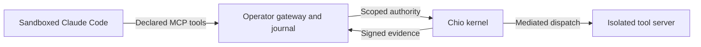

# Getting started

The complete operator walkthrough for Chio for Claude Code: installing
`chio-claude`, the local demo, preparing a kernel session, running Claude
through the kernel, the supported boundary and recovery. The
[README](../README.md) is the short tour.

## What it does

Run Claude Code against tools and data controlled by the [Chio kernel](https://github.com/backbay-labs/chio). The restricted launcher gives Claude an explicit MCP tool inventory while the operator retains the kernel credentials, resource access and execution journal.

- **Scoped access.** The kernel checks the prepared session's delegated authority before protected work.
- **Bound results.** The gateway verifies the receipt signer, caller, request and returned output before accepting an execution result.
- **Recoverable uncertainty.** Unknown outcomes remain in the private journal and block new dispatch until the operator resolves them.
- **Native session interface.** Inspect scope, exact action reviews, retained evidence and session-specific revocation requests while Claude works.

**Status:** Version 0.4.0-rc.5 adds the [native mod interface](NATIVE-MODS.md) against pinned Claude Code 2.1.287. The [controlled-task workflow](CONTROLLED-TASKS.md) adds artifact-bound completion evidence, guided scopes, exact continuation and the typed `$.chio` interface. The trusted operator service supplies session-scoped status and accepts review intent; kernel authority and protected execution remain outside the host. The interactive protected profile remains a qualification candidate. Earlier [bounded real-host evidence](https://github.com/backbay-labs/chio-claude-code-plugin/blob/65ac8390c57a5292c055fba50caa1aafbd915848/acceptance/2026-09-10/final-static-continuation/README.md) pins a different host and does not qualify this version.

The [dedicated-environment report](../acceptance/2026-10-03/qualification-environment/REPORT.md) records shared VM recovery, restored backups and live enforcing failures. `/chio-doctor` diagnoses the exact session without submitting work; the separate operator probe checks guest and image availability. An observed native write remains fenced after its durability syscall failed. Production qualification is still incomplete.

Native commands include `/chio`, `/chio-status`, `/chio-review`, `/chio-evidence`, `/chio-revoke`, `/chio-task`, `/chio-completion`, `/chio-continue`, `/chio-outcome` and `/chio-why`. See the [native interface runbook](NATIVE-MODS.md) for activation, scoped credentials and operator confirmation. An ordinary session displays **kernel MCP tools only**; a mod does not confer protection on native Bash or file tools.


## Install

Requires Node.js 22 or newer. Protected runs require macOS.

```sh
npm install -g @chio-protocol/claude-code-plugin
chio-claude --help
```

This installs the `chio-claude` command and everything it runs: the restricted
launcher, the kernel gateway, the model relay, the Chio pane and the bundled
Chio bridge. It installs no kernel. `chio-claude` keeps its state in
`CHIO_HOME`, which is `$CHIO_CLAUDE_HOME` or `~/.chio/claude`:

| Path | Contents |
| --- | --- |
| `host/claude-VERSION` | The pinned Claude Code host from `chio-claude host` |
| `gateway.json` | The prepared session from `chio-claude prepare` |
| `runs/ID/` | One run: its new `profile/`, empty `workspace/` and control files |
| `demos/ID/` | One demo: owner directory, journal and its private configuration |

Until the package is on npm, [build from source](#build-from-source) and run
`npm install -g .` in the checkout.

## Try it locally

```sh
chio-claude demo
```

The demo starts a fixture kernel on this machine: the real gateway and control
service, an operator watch screen in that terminal, and a throwaway owner
directory under `CHIO_HOME/demos`. In a second terminal:

```sh
chio-claude demo attach
```

This opens Claude Code against the demo with the Chio pane loaded. Ask Claude to
write a file with the chio tool, approve it in the watch screen, then continue
it from the Chio pane. Nothing is protected: the fixture kernel signs with a key
made for that run only, and every Chio surface says DEMO. The pane needs the
pinned Claude Code version; `chio-claude host` downloads it.

From a source checkout without the CLI,
`node scripts/demo.mjs --directory /tmp/new-chio-demo` starts the same demo and
prints the full `claude` command for the second terminal.

## Build from source

Install Node.js 22 or newer and Git, then build the public checkout:

```sh
git clone https://github.com/backbay-labs/chio-claude-code-plugin.git
cd chio-claude-code-plugin
npm ci --ignore-scripts --no-audit --no-fund
npm run build
npm install -g .
```

The last command links `chio-claude` to this checkout.
The npm lockfile and checked-in `vendor/` archives supply the Chio bridge and SDK. No sibling checkout is required. The build produces the bundled runtime in `dist/`. npm is the supported source-install path; the obsolete Bun lockfile referenced a sibling bridge and an unavailable registry dependency.

Building the plugin does not prepare a kernel session. Protected execution also requires macOS, a qualified Claude executable, a compatible running kernel and an isolated resource server. Follow the [operator preparation guide](RESTRICTED-MODE.md#boundary-and-preparation) before launching work.

## Run through the kernel

```sh
chio-claude host
chio-claude prepare /operator/private/claude-prepare.json
chio-claude run "Read /workspace/notes.md and write a summary to /workspace/summary.md"
```

### 1. Get the pinned host

`chio-claude host` downloads the Claude Code version this package is pinned to
into `CHIO_HOME/host` and checks its SHA-256 against
[`host-contract.json`](host-contract.json). It never replaces your own `claude`.
`chio-claude run` uses `CHIO_CLAUDE_HOST` when it is set, and refuses if that
file does not match the pin. Otherwise it uses the downloaded host, then a
`claude` on your `PATH` whose digest matches the pin.

### 2. Prepare authority

The operator chooses the policy, trusted receipt signers and allowed tools, then
prepares a retained kernel session. The request holds operator authority, so it
must be a private regular file (`chmod 600`); `chio-claude prepare` refuses
anything else and says why.

```sh
chio-claude prepare /operator/private/claude-prepare.json
```

This runs the bundled bridge's preparation command and writes the private
gateway configuration to `CHIO_HOME/gateway.json`; `--output NEW_FILE` writes it
elsewhere. It refuses to replace an existing configuration. The
[runbook](RESTRICTED-MODE.md#boundary-and-preparation) describes the input fields
and required kernel contract. Preparation pins the session and capability,
exchanges operator authority for a scoped credential, and writes the private
gateway configuration. It executes no protected tool.

### 3. Run a task

```sh
chio-claude run "Read /workspace/notes.md and write a summary to /workspace/summary.md"
```

> Read `/workspace/notes.md`, write a concise summary to `/workspace/summary.md`, then read the summary back.

Those paths belong to the resource owner. The launcher's local workspace does not give Claude direct access to that storage.

`chio-claude run` fills in every launcher option:

| Launcher option | Default | Override |
| --- | --- | --- |
| `--host`, `--host-sha256` | The pinned host and its checksum from `host-contract.json` | `--host`, `--host-sha256` |
| `--gateway-sha256` | The gateway digest in the current candidate record | `--gateway-sha256` |
| `--gateway-config` | `CHIO_HOME/gateway.json` | `--gateway-config` |
| `--profile` | A new private directory under `CHIO_HOME/runs` | None: every run gets a new profile |
| `--workspace` | A new empty directory beside the profile | `--workspace` |
| `--model` | `claude-sonnet-5-5` | `--model`, or `CHIO_MODEL` |
| `--model-auth` | `claude-login`, or `api-key` when `ANTHROPIC_API_KEY` is set | `--model-auth` |
| `--mode`, `--mod-sha256` | `interactive` with the recorded native mod digest when no task is given | `--mod-sha256` |

`claude-login` uses the operator's existing Claude subscription login through the
trusted parent relay. API-key mode is also available. See
[authentication setup](RESTRICTED-MODE.md#existing-claude-subscription-login)
and [launch requirements](RESTRICTED-MODE.md#launch).

With no task, `chio-claude run` opens an interactive Claude Code session with
the Chio pane. Pass `-` to read the task from stdin, and `--json` to print the
host's raw stream-json instead of the transcript.

To launch with pins from a specific qualification record instead, call the
launcher directly. The profile must be new, and the local workspace must already
exist. Keep the profile, gateway configuration and journal in separate locations
outside the local workspace.

```sh
node scripts/restricted.mjs \
  --host /absolute/path/to/claude \
  --host-sha256 "$CLAUDE_HOST_SHA256" \
  --gateway-sha256 "$CHIO_GATEWAY_SHA256" \
  --gateway-config /operator/private/new-claude-gateway.json \
  --profile /operator/new-claude-profile \
  --workspace /operator/empty-workspace \
  --model-auth claude-login \
  --model "$CHIO_MODEL" < /operator/task.txt
```

### 4. Inspect the outcome

`chio-claude run` ends by naming the recorded outcome and the path of its
`exit.json`. Its exit code is the launcher's:

| Code | Meaning |
| --- | --- |
| 0 | Completed |
| 1 | Refused before launch (a pin, file mode or credential check; the message says which), or the host did not start with the exact Chio tools |
| 2 | An unresolved outcome, kept fenced |
| 3 | Incomplete protected work: denied, not dispatched or a tool error |
| 4 | Waiting for operator approval |
| 64 | A usage mistake in `chio-claude` itself; nothing started |

Any other code is Claude Code's own exit status. A pending approval is confirmed
from the watch screen, `chio-claude control watch --operator-file PRIVATE_FILE`,
where the private file holds the operator's admin token; see
[operator confirmation](NATIVE-MODS.md#confirm-a-decision-outside-claude).

The profile retains `launch.json` and `exit.json`; the private gateway journal retains request-bound outcomes. Treat `state: completed` with verified evidence and `result.isError: false` as a successful tool result. A model's summary alone is insufficient. Unknown results stay unresolved and must not be retried automatically.

Output sanitization can mask a filename without invalidating a successful operation. Later authorized steps retain the original known path. See [result semantics](RESTRICTED-MODE.md#result-semantics) for the distinction between output masking, receipt redaction and tool errors.

## Supported boundary



The macOS sandbox restricts Claude to the operator's local MCP transport and bounded Messages relay, plus the session-scoped control service in an interactive session. Kernel credentials, the authoritative journal, protected storage and resource credentials remain outside the host's access.

| Available in restricted mode | Unavailable in this mode |
| --- | --- |
| Operator-declared Chio tools, including qualified filesystem workflows | Native Bash, file tools and direct web tools |
| A fresh isolated host session with retained kernel authority | Arbitrary MCP servers, plugins, hooks and custom skills |
| Operator-controlled recovery of retained outcomes | Delegation, background jobs and automatic session resume |

The resource owner must enforce this boundary. A host-visible resource mount or an unguarded second endpoint would defeat it. Expanding the tool or host surface requires its own qualification.

### Compatibility plugin

For diagnostics and bounded hook-contract testing, this repository also remains a Claude marketplace:

```sh
claude plugin marketplace add backbay-labs/chio-claude-code-plugin
claude plugin install chio@chio
```

This installation does not enable the restricted launcher. Real-host probes found that several hook failures let an otherwise permitted native tool execute. Hook configuration therefore does not establish complete mediation. See [compatibility-hook behavior and state](RESTRICTED-MODE.md#compatibility-hooks) and the [host contract probes](../SMOKE.md). By default the hooks check only sessions bonded with `/chio:bond`; set the plugin's `compatibility_hooks` option to `always` to deny tools in unbonded sessions, or `off` to disable them.

## Recovery

After interruption, retain the profile, original request IDs, gateway configuration and journal. Use the resource owner's independent record to determine what happened. Do not clear unknown operations to make a retry succeed.

- [Failure and recovery](RESTRICTED-MODE.md#failure-and-recovery): inspect retained state, recover dead-process locks and preserve unresolved effects.
- [Upgrade and removal](RESTRICTED-MODE.md#upgrade-and-removal): retain evidence, revoke old authority and qualify the replacement.
- [Pinned qualification records](https://github.com/backbay-labs/chio-claude-code-plugin/blob/65ac8390c57a5292c055fba50caa1aafbd915848/acceptance/2026-09-10/final-static-continuation/README.md): exact versions, executed cases and remaining scope.

## Development

From the source checkout with dependencies installed:

```sh
npm run typecheck
npm run build
npm test
npm run pack:release -- /absolute/new-candidate-directory
```

`pack:release` stages the production dependencies into a self-contained tarball and writes its SHA-256. Direct `npm pack` refuses an unbundled candidate. The [source/package workflow](../.github/workflows/ci.yml) additionally checks a fresh offline consumer installation. Build and component-test results do not establish real-host acceptance.

For native host-contract tests, read [SMOKE.md](../SMOKE.md) before using its isolated fixture. Its results include demonstrated hook bypasses and are separate from kernel qualification. See [packaging and release qualification](RELEASE-QUALIFICATION.md) for consumer-install checks and the prerequisites enforced by the [release workflow](../.github/workflows/release.yml).
