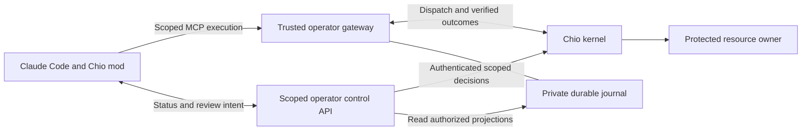

# Claude Code mods: research and Chio integration proposal

Research date: 2026-10-02. This document records source inspection and proposed work. It does not qualify a new host, mod, launcher, or release.

## Recommendation

Prioritize a native Chio mod interface immediately. Keep protected execution, authority issuance, receipt verification, budget accounting, and outcome recovery at the Chio kernel and trusted operator boundary.

The product opportunity is to make an agent's authority and consequential actions visible and usable inside Claude Code. Replacing the existing execution boundary with a user-installed hook would weaken the design: mods provide a better interception and presentation contract, but their default failure behavior still skips a failed hook.

Confidence: **high** in the opportunity and separation of responsibilities; **moderate** in the effort needed for a first read-only interface; **unknown** for an interactive protected launcher on a new host until it is built and qualified.

## Evidence and versions

| Item | Observed identity or result |
| --- | --- |
| Chio plugin checkout | `65ac8390c57a5292c055fba50caa1aafbd915848`, main |
| Package and plugin manifest | `0.3.1-rc.1` |
| Installed Claude Code | `2.1.285`, from `claude --version` |
| Documented default-on mods minimum | `2.1.287` |
| Existing retained protected-host evidence | Claude `2.1.267`; 23 bounded production-mode cases; complete I01-I08 and delivery acceptance remain open |
| Official Claude Code source cloned for inspection | `anthropics/claude-code`, `1c229fcd1e1e4e452e29a8f116b45fe4cfe2c528` |
| Version in that source's public mod declarations | `2.1.277`, explicitly early access |
| Official playground source cloned for inspection | `anthropics/claude-code-playground`, `569c5283d9a0a7ee7938df85bb32e4f48cbb8c86` |
| Current Chio marketplace manifest validation | Passed on installed `2.1.285`; root-directory validation selected the marketplace |
| Current Chio plugin manifest validation | Passed when its `plugin.json` was explicitly supplied |
| Playground Blast Radius static validation | Passed on `2.1.285`, including its hooks and mods API call inventory |
| Native mod control-flow test harness | Four tests passed on `2.1.285` with a process-scoped early-access flag; all tools were stubs |

Manifest and module checks are static validation. The four [control-flow tests](./mods-contract-probe/tests/control-flow.test.ts) confirm an unhandled hook failure reaches the stub, a pre-dispatch handler prevents that dispatch, and a post-dispatch handler preserves the original result without a second stub invocation. The positive control reaches the stub once. [Results and binary identity](./mods-contract-probe/RESULTS.json) and [test output](./mods-contract-probe/test-output.txt) are retained. The default test command was blocked as early access; the passing command set `CLAUDE_CODE_ENABLE_FUNCTION_HOOKS=1` for that process only.

No sample mod was loaded into a live session, and no new protected-host test was performed. Public declarations are older than the documented API baseline. Generate declarations from the exact host selected for implementation rather than copying the public file as the authoritative contract.

The existing [qualification record](https://github.com/backbay-labs/chio-claude-code-plugin/blob/65ac8390c57a5292c055fba50caa1aafbd915848/acceptance/2026-09-10/final-static-continuation/README.md) is retained historical evidence. It does not transfer to a newer binary. The separate release-qualification worktree was inspected only for status; its work remains independent.

## What the new platform actually provides

Mods are plugins with a function-hook entry point. The [overview](https://code.claude.com/docs/en/plugins/mods/overview) documents CLI and Desktop rendering, and hooks in other supported session kinds without the same UI. VS Code chat and print/SDK sessions therefore need text behavior and explicit handling when nobody can answer a question.

The [event guide](https://code.claude.com/docs/en/plugins/mods/events) describes middleware: `tool.call` can deny or answer a call, or pass it on through `next`; `tool.check` can change its permission verdict. A hook failure before `next` normally causes the host to skip that hook. Attach a `.catch` denial for pre-dispatch failures. Preserve the original result and journal state after dispatch; an error in presentation cannot undo an effect.

The [mods API](https://code.claude.com/docs/en/plugins/mods/api) supports native commands, including immediate commands during a turn, model calls, connected MCP calls, and process, file, and network access. Module code has no Node APIs and reaches side effects through `$`. This is an implementation constraint, not OS confinement: those API calls have the user's access, and spawned processes are outside Claude's Bash sandbox.

The [interface guide](https://code.claude.com/docs/en/plugins/mods/interface) supports panes, a band above the prompt, controls, and tool-row rendering. Session `$.state` survives hot reload but resets at lifecycle transitions; plugin `$.store` is shared across sessions and is not an atomic authorization ledger. Keep UI preferences there, and keep grants and execution facts in operator-owned durable state.

The [organization guide](https://code.claude.com/docs/en/plugins/mods/admin) offers managed policy mods. A privileged managed mod requires an enabled plugin from an administrator-controlled local directory marketplace with relative plugin paths. A remotely cached GitHub plugin does not acquire that tier just because managed settings enable it. Managed deny rules and hooks have specific precedence, while other mod API access needs separate controls.

The [creation guide](https://code.claude.com/docs/en/plugins/mods/create) explains host-generated declarations and a restrictive static analyzer. The module must use literal registrations and explicit `$` calls; it cannot import arbitrary Node packages. Reuse pure schema and view logic, with API effects in the entry module and ordinary bridge/runtime code in the trusted process.

The [test guide](https://code.claude.com/docs/en/plugins/mods/test) provides event tests and API stubs without inference, authentication, or network. These are useful for control and lifecycle behavior. Actual resource effects still need real-host observation.

## Current Chio implementation: what should change

| Current source | Finding | Proposed change |
| --- | --- | --- |
| [hooks configuration](../../hooks/hooks.json) | Command-based PreToolUse and PostToolUse; no native module | Add one native entry point for the chosen new-host release; explicitly select which compatibility hooks run |
| [PreToolUse](../../hooks/pretooluse.mjs) | Authorization precheck; comments document host-level failure and omission bypasses | Keep its evidence classification; qualify any new interceptor independently |
| [PostToolUse](../../hooks/posttooluse.mjs) | Correctly calls its result a host-reported, unverified observation | Preserve this distinction in the UI; show verified execution only from gateway evidence |
| [command files](../../commands/bond.md) | Markdown commands shell out through Node wrappers | Move interactive controls to deterministic `command.run` handlers and session-bound transport |
| [revoke](../../src/commands/revoke.ts) and [store](../../src/state/store.ts) | Revoke selects the sole or most recently bonded session | Require the actual current session, or an explicit operator-selected target; reject ambiguity |
| [approval](../../src/commands/approve.ts) | A local countersignature produces `status: approved` even when authority propagation is skipped or fails | Distinguish signed intent, submitted decision, accepted grant, and committed operation |
| [receipt export](../../src/commands/receipt-export.ts) | `session` export resolves to a time range using the sole/latest bond | Query exact session and operation identities; label any broader time-range export explicitly |
| [restricted launcher](../../scripts/restricted.mjs) | Print mode, bare/restricted flags, empty native tools, disabled slash commands, disabled hooks, empty plugin settings | Keep as a separate candidate; an interactive protected mod host requires a new launch contract |
| [sandbox](../../scripts/sandbox.mjs) | Parent-owned gateway/journal; only two exact network ports; trusted-operator mode denies process fork | Add only necessary immutable mod-code reads and scoped transport access in a separately qualified candidate |

The current [README](../../README.md) already distinguishes marketplace diagnostics from protected execution. The redesign should make that distinction visible in the actual interface.

## Product direction

### 1. Ambient session status

Show one quiet line with the connection, applicable protection scope, expiry, waiting reviews, and unresolved operations. Expand only when a decision is needed.

Illustrative copy, not live state:

```text
Chio · Kernel MCP tools protected · authority expires in 24m
1 action awaiting review · 0 unresolved operations
```

Normal interactive mode must describe protected MCP calls precisely; native Bash or file calls outside that boundary remain separately classified. An installed mod, a bonded capability, or a green connection indicator alone must never imply that every effect is governed.

Display a snapshot revision and its age. A lost connection makes the UI stale or unavailable; cached grant state cannot authorize a new action.

### 2. Action review

Open a focused pane for a specific pending operation. Show the effect, destination, payload or diff, information restrictions, authority requested, expiry, cost basis, and operation identifier. Use ordinary descriptions first and cryptographic detail on expansion.

Possible controls are Approve this exact action, Decline, and Request a permitted alternative. The trusted operator service must authenticate who may grant, validate the request binding, and return kernel acceptance. A mod button press or countersignature file is not sufficient evidence of a grant.

Tie a decision to the exact session, subject, tool, arguments, resource or destination, information restrictions, policy/contract version, budget basis, expiry, and nonce. Changing the pending action invalidates its review. Concurrent calls each have their own operation and controls.

The panel's preview should use retained kernel/resource-owner metadata. Do not execute arbitrary project code to construct a supposedly harmless dry run.

### 3. Action and evidence timeline

Make each consequential operation inspectable from the tool row or a session pane:

```text
requested -> awaiting review -> admitted -> dispatched -> verified outcome
                                                  \-> outcome unknown
```

Each view should distinguish an authorization receipt, a host observation, and a verified execution result. Explain result sanitization separately from operation success. Redaction in displayed text must not change the bound request.

The main review question is: what was requested, what authority permitted it, what effect was observed, and what remains uncertain? Export must preserve exact identities and omit operator secrets.

### 4. Recovery workbench

Surface outstanding original operations on reconnect. For an uncertain irreversible effect, show Reconcile original outcome and its independent evidence requirements. Keep the dispatch fence intact until the operator resolves the uncertainty.

Use three different paths: native resume for pending work; a new linked operation when a frozen denial is remedied by changed authority or arguments; reconciliation for an already-dispatched unknown outcome. A Retry button that simply calls the tool again would destroy the guarantee we want.

First demonstrate this with a disposable protected file write whose reply is lost. A later product demo can use a private ticket and an outbound reply in an isolated test resource, with one effect and one budget charge across interruption.

### 5. Capability controls

Show exactly which resources and effects the current subject can reach. Make revocation address that subject and session, and distinguish local disconnection, revocation requested, and kernel-confirmed revocation.

Revocation prevents future admitted work according to the kernel contract; it cannot erase a committed effect. Pending and in-flight operations remain in the timeline.

Authority expansion deserves explicit scoped review. Broad guard pausing should stay out of the primary action-review flow.

### 6. Cost and subagent visibility

Later, show provider usage, protected-tool budget reservations, committed charges, and subagent activity. Keep model pricing estimates and kernel accounting separate. A tool-cost limit does not by itself govern every model call.

Display subagents as distinct subjects with explicitly attenuated authority. Observing an `agentId` is useful correlation; it does not establish delegation. Cross-session messages also need information-flow treatment before becoming a governed collaboration feature.

### 7. Managed mod policy

For enterprise deployment, use a managed Chio policy mod to inspect static API inventories at module admission and observe relevant mod API events. Start with a pinned allowlist of reviewed mods. Evaluate file/process/network calls, model spending, environment changes, prompt impersonation, and cross-session messages as separate effect classes.

This is a separate deployment product: administrator-controlled installation, identity and update policy, ordering checks, and enforced resource boundaries. A marketplace install command alone does not provide it. Defer a broad third-party mod ecosystem until this profile is qualified.

## Proposed architecture



The control API is proposed work, not an endpoint verified in the current package. It can share the trusted gateway implementation; it must not introduce a second policy engine or independent retry coordinator.

The mod receives a short-lived, session-bound credential for permitted status and control requests. Kernel admin keys, resource credentials, provider credentials, and the authoritative journal stay outside the host. The server checks credential claims and operation bindings rather than trusting a session ID in request JSON.

The first control contract should expose a sanitized status snapshot and operation/evidence queries. Later additions can submit operator-authenticated decisions, revoke exact authority, and request reconciliation. Replies need identities, a revision, freshness, authoritative lifecycle state, and a verification classification. A transport error returns unavailable or unresolved, never a successful-looking grant.

The normal plugin profile can provide useful diagnostics and governed MCP access. An interactive protected profile must additionally constrain every route to protected resources, including new mod API calls. Keep the current print-mode candidate as its own supported scope during qualification of that expansion.

Avoid an authorization-precheck followed by a second execution path. The existing PreToolUse source explicitly rejects a historical daemon `check()` route that could dispatch a tool before Claude dispatched it again. Each protected operation should reach one kernel execution path and retain its returned evidence.

An experimental later slice could proxy native Read/Write calls into that path and answer with the host's required native result schema. This could make protected resource work feel familiar. Its feasibility is unverified: validate input/result mapping, reserved event fields, failure fallbacks, and confinement against the chosen host. General Bash execution needs a separately confined process model and cannot be inferred from file-tool mediation.

Potential source layout:

```text
hooks/mod/register.ts           event registration and explicit mods API effects
hooks/mod/contracts.ts          pure decoding and projection schemas
hooks/mod/view.ts               pure presentation helpers
types/index.d.ts               declared UI state
tests/mod/*.test.ts             native event/control/lifecycle tests
src/operator/control.ts        trusted gateway control projection and requests
```

Names registered through the native command API must meet its restricted syntax. Proposed native names are `/chio`, `/chio-status`, `/chio-review`, `/chio-revoke`, and `/chio-evidence`; test their resolution alongside existing `/chio:...` Markdown commands before declaring compatibility.

## Delivery sequence

| Slice | Deliverable | Exit condition |
| --- | --- | --- |
| 0. Host contract | Isolated exact host at or above the documented mods baseline; generated declarations; recorded binary identity; modules and settings-hook ordering inventory | Static validation and deterministic event probes agree with actual load/failure behavior |
| 1. Read-only native interface | Status line, session/evidence pane, native status command, unavailable/headless handling | Truthful state and session identity through reload, clear, resume, branch, disconnect, and concurrent sessions; no runtime approval capability |
| 2. Exact control semantics | Session-specific revocation, accepted-decision states, operation-bound reviews, durable pending state | Kernel acknowledges decisions for the exact operation; stale, replayed, forged, wrong-session, and changed-payload decisions fail |
| 3. Interactive protected candidate | Pinned Chio mod, bounded native commands, immutable code reads, least-privilege operator transport, OS/resource confinement | Useful allowed work and denied/bypass/failure cases observed in the actual host with an independent resource owner |
| 4. Recovery and release | Original-outcome recovery, linked remedies, evidence export, versioned cold installation and upgrade/removal | Retained operation reconciles without duplicate effect or charge; public delivery and I01-I08 claims match collected evidence |

Start the first two slices immediately. Do not tie read-only UX delivery to completing the entire interactive confinement redesign. Keep release assertions specific to each completed slice.

## Acceptance experiments that determine the design

1. Useful positive control: real Claude reads a protected fixture, writes a requested change, and reads it back through the kernel. Independent observation and verified request/result receipts agree.
2. Pre-dispatch failure: thrown hook, wrong result shape, own-time timeout, and failed `.catch` do not produce an unauthorized protected effect. The last case must rely on the resource boundary, not the handler's reliability.
3. Composition: another mod rewrites arguments, approves permission checks, short-circuits a call, invokes MCP, or attempts direct file/process/network access. Record which layer observes or prevents each route.
4. Omission and lifecycle: missing, disabled, uninstalled, failed-to-load, or reloaded mod; safe mode; managed configuration; clear/resume/branch; gateway loss; host crash. Protected work must preserve its stated admission boundary even when presentation disappears.
5. Approval races: simultaneous pending calls, a changed payload while review is open, stale policy, expired/revoked authority, repeated decisions, foreign session, and a forged operator identity. No grant may drift to a different operation.
6. Unknown outcome: commit a fixture write, drop its response, restart the host/gateway, and reconcile the original request. Observe one effect, one charge, and the retained fence before reconciliation.
7. UI surfaces: terminal at 80/120/144 columns, Desktop, VS Code chat, print mode, and SDK. Every supported surface either exposes a usable control or returns a deterministic pending/denied response; no invisible approval wait.
8. Release behavior: generate types and run static validation against the chosen host; build and component checks; cold consumer install; package contents; pinned code and update; removal with retained journals. Existing 2.1.267 evidence stays attributed to that binary.

## What to borrow from Anthropic's samples

The playground samples provide pane/band composition, action holding, context visualization, and edit review. Inspect the [pinned Blast Radius source](https://github.com/anthropics/claude-code-playground/blob/569c5283d9a0a7ee7938df85bb32e4f48cbb8c86/claude-code/mods/blast-radius/hooks/blast-radius.mjs) as a UI example, not Chio's execution design. Its hold uses repeated `sleep` subprocesses and its risk preview can run project migration-status code. Its scope is Bash pattern matching. Those choices do not fit the current no-fork restricted host or exact durable authority review.

The [pinned built-in guard](https://github.com/anthropics/claude-code/blob/1c229fcd1e1e4e452e29a8f116b45fe4cfe2c528/mods/sec-default/hooks/register.ts) is a useful source example for tiers, host-provided provenance, and error handling. Its associated declaration snapshot predates the documented default-on mods release, so validate these contracts against generated types and the actual chosen host.

## Decisions and remaining unknowns

- Adopt native mod presentation and commands: **high confidence**.
- Keep one Chio authority/execution/recovery lifecycle: **high confidence**.
- Treat generic native-tool interception as fully protected before independent host evidence: **rejected**.
- Best first scope: read-only session status and evidence, then exact scoped review: **moderate confidence**; this is an engineering recommendation, not a measured delivery estimate.
- Interactive pinned mod compatibility with the existing launcher sandbox, terminal support, and managed settings: **unknown** until the new profile is exercised.
- Whether Claude provides adequate trusted operator provenance for every approval interaction: **unknown**. Enforce operator authentication at the trusted service; investigate built-in UI provenance instead of assuming a button is an authority boundary.
- How much of the pending/continuation recovery contract is ready for a joined product flow: **unknown** in this research pass. The proposed interface must follow the kernel's actual retained operation lifecycle.

The intended product is Chio's authority and evidence made native to Claude Code: users can see what an agent may do, review the exact consequential action, and resolve uncertainty without losing execution integrity.
